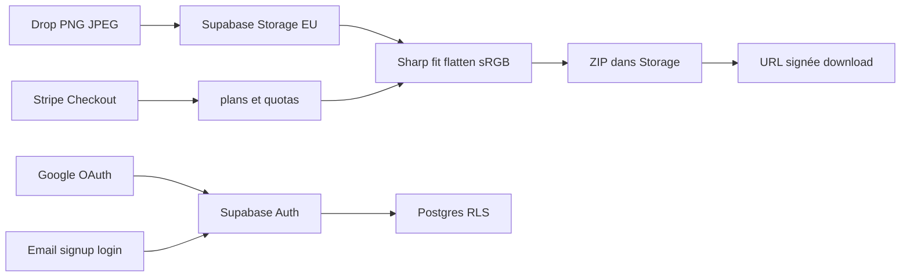

---
todos:
  - id: supabase-slot
    status: completed
    content: 'À l’exécution : pauser Sequelizer (Free = 2 actifs), créer projet DuoShot eu-west-3'
  - id: scaffold
    status: in_progress
    content: Scaffold Next.js App Router + Tailwind + @supabase/ssr + constantes specs
  - id: pipeline
    content: 'Pipeline Sharp via Storage (contournement 4,5 Mo) + ZIP + tests pixels/alpha'
    status: pending
  - id: auth
    content: 'Auth Google + email signup/login (magic link et mot de passe), RLS, sièges'
    status: pending
  - id: tool-ui
    content: 'Landing, /tool drop/preview dual, /specs SEO-GEO'
    status: pending
  - id: legal
    content: 'Pages RGPD/CCPA/UK/LGPD, consentement, export/suppression compte'
    status: pending
  - id: stripe
    content: Stripe 4 offres + quotas ; Vercel Pro avant paiements live
    status: pending
  - id: verify
    content: 'Build, tests, parcours navigateur drop → ZIP + auth'
    status: pending
name: DuoShot v1 SaaS
overview: 'SaaS DuoShot v1.0 sur Next.js + Supabase (Paris) + Vercel : Google et email signup/login, pipeline screenshots Duo, Stripe, SEO/GEO et pages RGPD. Apple Sign In hors v1. Slot Free : pauser Sequelizer à l’exécution.'
isProject: false
---

# DuoShot v1.0 — générateur de screenshots Duo

Nom figé : **DuoShot**. Scope : **v1.0 complète**. Frames device **gelés**. Sources : [raffinage S01](/home/ubuntu/.cursor/projects/workspace/uploads/raffinage-S01-screenshots-duo_682f.md) et [base de connaissances](/home/ubuntu/.cursor/projects/workspace/uploads/iphone-duo-base-connaissances_180e.md). Repo actuel : [README.md](/workspace/README.md) seulement.

## Décisions figées (cette itération)

- Auth v1 : **Google + email** (signup **et** signin). **Pas d’Apple** en v1 (compte Developer Program requis pour le web).
- Backend : **Supabase** (Postgres, Auth, RLS, API REST, Storage) — plus Auth.js / Drizzle / SQLite.
- Slot Free : **Sequelizer** (`moobnoicyrioxtrarvzf`) sera **pausé à l’exécution** pour libérer 1 des 2 actifs. MCP n’a pas `delete_project` — pause = slot libéré ; suppression définitive = dashboard Supabase si tu veux l’effacer ensuite.
- Projet DuoShot neuf, région **`eu-west-3` (Paris)**, org existante **Spocsk** (`bzssnplaijsxrsmraofq`). Coût création : **0 €/mois**.
- Front : **Vercel**. Nouveau projet Hobby **possible sans payer** (2/200 projets). Stripe live = usage commercial → **Pro ~20 $/mois** (fair use Hobby = perso / non-commercial).
- Uploads : **pas** via le body Vercel Function (limite **4,5 Mo**). Client → **Supabase Storage** EU, Sharp côté serveur, ZIP relû via URL signée.

Ne pas créer ni pauser quoi que ce soit tant que ce plan n’est pas exécuté.

## Comptes constatés (lecture seule, 12 sept. 2026)

Supabase org Spocsk, Free (2 projets actifs max) :

- **Sequelizer** — ACTIVE — `eu-west-1` — **à pauser**
- **le-cabinet-du-quai** — ACTIVE — `eu-west-3` — on garde
- **cast-loop** — déjà INACTIVE — pauser ne libère rien

Vercel team **spocsk's projects**, plan **hobby** :

- `le-cabinet-du-quai` et `portfolio-victor-couto` (GitHub org `Spocsk`)
- Créer un 3e projet Hobby : OK côté quota. Brancher un **repo GitHub org** peut parfois forcer Pro ; préférer un repo personnel `DuoShot` si l’import bloque.

## Architecture

Stack :

- Next.js App Router + TypeScript + Tailwind
- `@supabase/ssr` (cookies PKCE) — **pas** l’ancien auth-helpers
- Sharp en route handlers **Node** (pas Edge)
- Stripe Checkout + webhooks — Dylan a ajouté les secrets côté dashboard (12 sept.). **Cette VM ne les a pas** (injection au démarrage seulement). Les workers `new_cloud_vm` / un nouvel agent les recevront. Fallback : SMTP Free Supabase + Checkout mock si toujours absents.
- Resend — même contrainte.

### Transmettre les clés (ne jamais coller dans le chat)

Canal sûr : [Secrets Cloud Agents](https://cursor.com/dashboard/cloud-agents) → type **Runtime Secret** (chiffré, masqué `[REDACTED]` dans le transcript). Puis **nouvel agent** (cette session ne les verra pas).

Noms : `STRIPE_SECRET_KEY` (sk_test_… d’abord), `NEXT_PUBLIC_STRIPE_PUBLISHABLE_KEY` (pk_test_…), `STRIPE_WEBHOOK_SECRET` (plus tard), `RESEND_API_KEY`.

Prod : mêmes vars en **Vercel → Environment Variables → Sensitive**, jamais dans git. Pas de `sk_live_` tant que le checkout n’est pas réel.
- Constantes pixels dans `lib/specs.ts`

Règle kit : hinge = interaction, regions = layout. Ici on mappe des **pixels d’étagère**, pas l’angle de charnière.

## Auth (signup + signin)

Pages `/signup` et `/login` (même providers) :

- **Google** : OAuth (`signInWithOAuth`), client Google Cloud, redirect `https://<ref>.supabase.co/auth/v1/callback`, callback app `app/auth/callback/route.ts` → `exchangeCodeForSession`
- **Email mot de passe** : `signUp` (mail de confirmation) + `signInWithPassword`
- **Email magic link** : `signInWithOtp` (même flux signup/signin, crée le user si besoin)
- SMTP custom **Resend** dès que le quota mail Free Supabase sature
- Linking d’identités si même email Google + mail (réglage dashboard, avec prudence)

Hors v1 : Sign in with Apple (App ID + Services ID + JWT `.p8`, ~99 $/an).

Preview outil sans compte ; **download ZIP = compte**.

## Supabase — schéma + RLS

Tables `public` (RLS on, jamais `user_metadata` pour l’authz — `app_metadata` / tables) :

- `workspaces`, `workspace_members` (Studio : 3 sièges)
- `apps`, `export_sets`, `daily_export_counts`
- `consent_events` (base légale, version politique, timestamp)
- `dsar_requests` (accès / export / effacement)

Policies : owner / member voient leur workspace. Pipeline Sharp : server avec JWT user, **jamais** `service_role` dans le client (`NEXT_PUBLIC_` = publishable/anon seulement).

Storage buckets : `uploads` et `exports`, privés, policies `auth.uid()`. Rétention : sources + ZIP **24 h** (minimisation). Pas de conservation des captures d’apps clientes.

API REST PostgREST : exposée sous RLS. Vues en `security_invoker`. Fonctions sensibles hors schéma public.

SMTP + URLs redirect allowlist (`duoshot.vercel.app`, domaine custom).

À l’exécution seulement : `get_cost` (déjà 0 €) → `confirm_cost` → pauser Sequelizer → `create_project` name `DuoShot` region `eu-west-3`.

## Vercel

- **Oui**, tu peux créer un **nouveau projet Hobby sans payer** (quota projets largement OK).
- Hobby pause si tu dépasses (1M invocations, 100 Go transfer, CPU 4 h…). Pas de sur-facture.
- **Stripe / pub / vente** = commercial → [fair use](https://vercel.com/docs/limits/fair-use-guidelines) exige **Pro (~20 $/user/mois)**. Reco : déployer Hobby pour preview ; **passer Pro avant le checkout live**.
- Functions : body **et** réponse max **4,5 Mo**. D’où Storage + URL signée (un ZIP inner 10 PNG dépasse 4,5 Mo).
- Durée max Hobby : 300 s — OK pour Sharp sur 10 images si on traite une par une.

## Produit (inchangé)

Landing, `/specs`, `/tool` (drop 1–10, orientation unique, outer+inner défaut, 6.9" si plan, fit Smart, fond, titres, preview dual, ZIP).

Tailles : outer 1398×2034 / 2034×1398 ; inner 2007×2853 / 2853×2007 ; 6.9" 1320×2868 / 1290×2796 / 1260×2736.

Plans : Free 1 set HD/j Duo-only + README marqué ; Indie 12 €/mo ou 29 € launch 60 j ; Studio 49 €/mo ; pack 19 €/app.

## SEO / GEO (site public)

Objectif : être **la** source citée pour les pixels Duo (humains + moteurs génératifs).

- `/specs` indexable : tableau pixels, date de version, canonical, disclaimer 2.3.3
- Metadata App Router : title/description uniques, Open Graph, Twitter, `hreflang` fr/en
- `sitemap.xml`, `robots.txt` : laisser GPTBot, ClaudeBot, PerplexityBot, Google-Extended (GEO) ; pas de `/tool` ni `/account` dans le sitemap
- JSON-LD : `Organization`, `SoftwareApplication`, `FAQPage` (tailles, boxed window, étagère séparée)
- FAQ visible sur `/` et `/specs` (mêmes questions que le schema)
- `/llms.txt` (+ option `/llms-full.txt`) : pitch + pixels + lien specs, pour les crawlers IA
- Contenu factuel court, dates, sources Apple — pas de prose creuse
- Perf : landing statique / ISR ; pas d’analytics tant que le consentement n’est pas en place

Hors v1 : blog, Programmatic SEO 40 langues.

## Données perso — RGPD et équivalents

Mesures **produit** (pas un avis d’avocat). Responsable : toi (FR / CNIL). DuoShot = responsable de traitement ; Supabase, Vercel, Stripe, Resend, Google = sous-traitants.

Pages :

- `/privacy` — RGPD + **UK GDPR** + mention **CCPA/CPRA** (Do Not Sell — on ne vend pas) + **LGPD** (si trafic BR)
- `/terms`
- `/cookies` — cookies strictement nécessaires (session Auth) ; **pas de bandeau** tant qu’il n’y a pas d’analytics / pubs (CNIL / ePrivacy)
- `/legal/subprocessors` — liste datée + région
- Compte : **export JSON** + **suppression** (efface Auth user + lignes RLS + Storage) sous 30 jours — droits d’accès / portabilité / effacement
- Signup : case **âge 16+** (CNIL) + lien politique + version consignée dans `consent_events`

Bases légales :

- Compte + export screenshots : **contrat** (art. 6.1.b)
- Facturation Stripe : **obligation légale** + contrat
- Mail produit (magic link, reçus) : contrat
- Marketing : **consentement** opt-in, pas en v1
- Transferts US (Vercel, Stripe, Google OAuth) : DPF / CCT — le documenter dans `/privacy`. Données app (captures, profil) **primaires à Paris**.

Ops :

- Signer les DPA : [Supabase](https://supabase.com/docs/guides/security/gdpr-compliance), Vercel, Stripe, Resend
- Registre des traitements (art. 30) court dans `docs/ropa.md` (interne repo)
- Violation : procédure 72 h CNIL (template, pas un outil)
- Pas de DPO obligatoire en solo (art. 37) — à réévaluer si scaling
- CCPA : seuil souvent non atteint au lancement ; on met quand même le lien « Do not sell » et la suppression compte
- Pas de PostHog / GA en v1 (évite CMP). Si analytics plus tard : bandeau opt-in avant tout tracker

## Hors scope

Frames 2D/3D, Apple Sign In, tent/clock, videos, Connect upload, i18n captions, A/B, API publique, white-label sous-domaine, CMP analytics.

## Vérif

- Tests pipeline (pixels, flatten, orientation, gating 6.9")
- `next build`
- Navigateur : signup Google + email, drop → preview dual → ZIP via URL signée, `/specs` + JSON-LD, export/suppression compte
- Ne pas lancer Stripe live ni Vercel Pro sans ton OK

## Specs à copier dans le repo

Les deux MD uploadés → `docs/` du repo.
